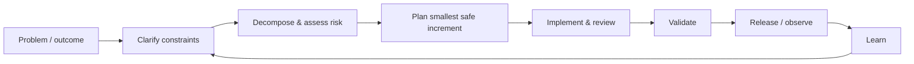

# SDLC, requirements clarification and decomposition

## Wall Note / A4

- Start from the **outcome and observable behavior**, not the requested implementation.
- Clarify actors, happy path, failure paths, data ownership, constraints, non-goals and acceptance evidence.
- Separate **facts, assumptions, decisions and open questions**.
- Decompose by user/business capability or risk boundary, not by technical layer alone.
- A requirement is not ready when important behavior can still be interpreted in two materially different ways.
- Ask “what must remain true?” for compatibility, security, performance and operations.
- Prefer examples and edge cases over ambiguous adjectives such as “fast”, “simple” or “secure”.
- Do not require perfect certainty; identify uncertainty and decide how to retire it cheaply.
- Keep traceability lightweight: requirement → decision → change → validation.
- Revisit requirements when production evidence or new constraints invalidate assumptions.

## Detailed Notes

### A practical SDLC

A strong lifecycle is not a rigid waterfall. It is a feedback system:

The artifacts should be proportional to risk. A two-line bug fix may need a clear issue and tests. A cross-service migration may need an RFC, ADRs, compatibility plan, staged rollout and rollback conditions.

### Clarification sequence

Use a consistent sequence:

1. **Outcome** — What user, business or system result should change?
2. **Current state** — What happens now? Where is the evidence?
3. **Actors and boundaries** — Who calls what? Which system owns the data or invariant?
4. **Functional behavior** — Inputs, outputs, state transitions, validation, failure semantics.
5. **Quality constraints** — Availability, latency, security, privacy, compliance, operability.
6. **Compatibility** — Existing clients, stored data, APIs, workflows, reports.
7. **Acceptance evidence** — What would prove the change is correct?
8. **Non-goals** — What tempting adjacent work is explicitly excluded?
9. **Unknowns** — Which unanswered question could change architecture, estimate or rollout?

### Decomposition

Good decomposition creates slices that are:

- independently understandable;
- independently testable;
- independently reviewable;
- safe to deploy;
- useful for retiring uncertainty or delivering value.

Avoid “backend task / frontend task / database task” as the only decomposition. That often creates large integration batches. Prefer vertical slices where possible: one supported workflow end-to-end, one API capability plus one consumer, one migration phase, one compatibility adapter.

### Failure modes

- **Solution-first requirements**: “add Kafka” when the real need is delayed decoupled processing.
- **Hidden non-functional requirements**: correctness is discussed; load, authorization and recovery are not.
- **Acceptance by intuition**: no concrete examples, boundary values or failure expectations.
- **Premature decomposition**: tasks are created before dependencies and unknowns are understood.
- **Infinite discovery**: engineers refuse to start until every future question is resolved.
- **Scope drift**: nearby cleanup is quietly folded into a delivery commitment.

### Example

Request: “Make exports faster.”

Weak clarification: “Optimize the SQL.”

Strong clarification: determine export sizes, current p50/p95 completion time, timeout behavior, synchronous vs asynchronous user expectations, memory limits, permission checks, format requirements and whether stale data is acceptable. The best solution may be query tuning, streaming, asynchronous jobs, precomputation or simply a better limit.

## Practical Scenarios

### Scenario 1 — ambiguous role change

Product asks: “Managers should edit employee records.”

Before coding, clarify which employee fields, whether managers can edit themselves, hierarchy boundaries, audit requirements, effective dates, concurrent changes and whether existing API clients inherit the permission.

### Scenario 2 — “simple” integration

A partner asks for a webhook. Clarify delivery guarantees, retries, ordering, signing, duplicate handling, replay, versioning, rate limits and ownership of failed deliveries. Those questions determine much more than the HTTP endpoint shape.

## Senior Questions / Review Exercises

1. Which unanswered requirement would most change implementation cost or architecture?
2. What is the smallest vertical slice that proves the core path?
3. Which invariants must remain true during and after the change?
4. Where are we relying on an assumption rather than evidence?
5. What should be an explicit non-goal to prevent accidental scope expansion?
6. Which requirement should be validated in production rather than only before release?

## Related / Prerequisites

- [Planning, estimation and risk](02-planning-estimation-risk.md)
- [Iterative delivery](03-iterative-delivery.md)
- [RFC/ADR decisions](06-rfc-adr-decision-making.md)
- [testing-engineering](https://github.com/YosrBennagra/testing-engineering)
- [software-architecture](https://github.com/YosrBennagra/software-architecture)