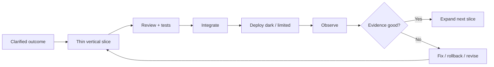

# Incremental and iterative delivery

## Wall Note / A4

- Reduce batch size until changes are easy to reason about, review and recover.
- Prefer **vertical slices** that produce evidence over horizontal layers that only integrate at the end.
- Keep mainline integration frequent.
- Separate deployment from user exposure when feature flags or configuration make that safer.
- Every increment needs a validation point.
- Reversible steps are cheaper than heroic rollback plans.
- Use scaffolding only when it directly enables an imminent slice.
- Do not confuse “many commits” with incremental value.
- Remove temporary compatibility and flags when their job is done.
- Optimize for fast feedback, not maximum parallel work in progress.

## Detailed Notes

### Delivery flow

Incremental delivery is a risk-control strategy. Each step should either deliver useful behavior or remove uncertainty.

### Slice patterns

- API read path before write path.
- One consumer before all consumers.
- New schema added before migration.
- Shadow computation before authoritative computation.
- Internal users before all users.
- 1% traffic before 100% traffic.
- Compatibility adapter before legacy removal.

### Iteration

Incremental = smaller pieces. Iterative = revising based on feedback. Mature teams need both. A perfectly decomposed plan that never adapts to evidence is still fragile.

### Work in progress

Too much parallel work creates hidden queues: waiting for review, waiting for QA, waiting for integration, waiting for rollout. Throughput can improve by finishing fewer things faster.

Ask:

- what is closest to done?
- what is blocked?
- what can be integrated now?
- what can be validated before adding more scope?

### Failure modes

- feature branches living for weeks;
- “phase 1” that delivers no testable behavior;
- permanent flags and duplicate paths;
- slicing by repository/component only;
- merging scaffolding with no near-term consumer;
- batching unrelated cleanup into feature delivery;
- measuring progress by percentage complete instead of validated outcomes.

## Practical Scenarios

### Scenario 1 — new search engine

Do not rewrite all reads first. Index a subset, run shadow queries, compare results and latency, then migrate one read path. Preserve fallback until confidence is high.

### Scenario 2 — large UI redesign

Ship component-by-component behind routing or capability boundaries instead of maintaining a long-lived parallel frontend that diverges from production.

## Senior Questions / Review Exercises

1. Which part of this change can be deployed safely this week?
2. What evidence does each increment produce?
3. Where will a long-lived branch or duplicate implementation drift?
4. Which temporary mechanism needs an explicit removal condition?
5. Can deployment and release be separated?
6. How can we reduce WIP without reducing useful throughput?

## Related / Prerequisites

- [Planning and risk](02-planning-estimation-risk.md)
- [PRs and integration](04-code-review-prs-integration.md)
- [Rollout and rollback](09-rollout-rollback.md)
- [devops-platform-engineering](https://github.com/YosrBennagra/devops-platform-engineering-)