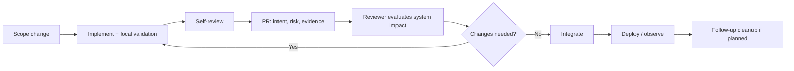

# Code reviews, pull requests and integration strategies

## Wall Note / A4

### Author
- Make the intent obvious before the reviewer opens the diff.
- Keep one conceptual change per PR where practical.
- Explain risk, testing, migrations, rollout and deliberate omissions.
- Self-review the diff; remove noise and accidental changes.
- Prefer small PRs, but do not split changes into unusable fragments solely to hit a line-count target.

### Reviewer
- Review **behavior, correctness, security, failure handling, compatibility and maintainability** before style.
- Ask whether the design is simpler than necessary, not merely whether it works.
- Distinguish blocking issues from suggestions.
- Explain the engineering reason behind important feedback.
- Review the changed system boundary, not only changed lines.

### Integration
- Prefer frequent mainline integration.
- Use branches as isolation tools, not long-term parallel realities.
- Choose merge/rebase/squash based on repository history needs; consistency matters more than ideology.

## Detailed Notes

### PR lifecycle

### What a good PR description contains

- **Why**: problem/outcome.
- **What**: conceptual changes, not file narration.
- **Risk**: behavior or data that could be affected.
- **Evidence**: tests, screenshots, benchmarks, migration checks.
- **Operations**: rollout/rollback, flags, observability if relevant.
- **Non-goals**: important things intentionally not changed.

### Review dimensions

1. Correctness and invariants.
2. Edge/failure paths.
3. Security/privacy boundaries.
4. Data and compatibility behavior.
5. Concurrency/idempotency when relevant.
6. Performance/resource impact when relevant.
7. Test quality and missing tests.
8. Operability and diagnostics.
9. Complexity and maintainability.
10. Documentation/migration follow-through.

Deep testing/security/observability technique belongs in the dedicated repositories; this file focuses on review practice.

### Change sizing

Small changes reduce cognitive load and merge risk, but “small” is contextual. A 300-line generated migration and a 300-line handwritten algorithm are not equally reviewable.

Split when changes can be independently understood and safely integrated. Do not split tightly coupled invariant changes in ways that temporarily break mainline.

### Branching/integration strategies

- **Trunk-based / short-lived branches**: good default for frequent integration.
- **Feature branches**: acceptable when short-lived and synchronized.
- **Release branches**: useful when multiple supported release lines exist.
- **GitFlow-style long-lived branches**: may fit constrained release models, but adds merge complexity and stale branch risk.

The senior question is not “which strategy is fashionable?” It is “what release/support constraints justify the integration cost?”

### Review communication

Use precise language:

- “Blocking: this can double-charge because retry is not idempotent.”
- “Suggestion: extracting this helper may improve readability, but current form is safe.”
- “Question: is this behavior intentional for archived accounts?”

Avoid authority-based comments like “I would never write it this way.”

### Failure modes

- style review dominating correctness;
- approval without reading because tests are green;
- reviewers rewriting code through comments instead of reviewing;
- enormous PRs mixing feature, refactor and formatting;
- authors hiding context and expecting reviewers to reconstruct intent;
- review queues becoming a delivery bottleneck;
- long-lived branches with late conflict/integration discovery.

## Practical Scenarios

### Scenario 1 — 2,000-line PR

Separate mechanical rename/formatting from behavioral changes, but keep any invariant that must change atomically together. Ask the author for an architectural summary and review by risk area.

### Scenario 2 — reviewer disagreement

Two valid designs exist. If the current design satisfies agreed constraints and the alternative is preference only, avoid blocking. If the choice has lasting system cost, move the decision to an ADR/RFC.

## Senior Questions / Review Exercises

1. What is the highest-risk behavior in this diff?
2. Which changed boundary has not been tested or observed?
3. Is this PR doing more than one conceptual job?
4. Which comment is blocking versus preference?
5. Could this integrate safely earlier?
6. What follow-up debt is being created, and is it explicit?

## Related / Prerequisites

- [Iterative delivery](03-iterative-delivery.md)
- [Standards and Definition of Done](05-standards-dod-documentation.md)
- [RFC/ADR decisions](06-rfc-adr-decision-making.md)
- [testing-engineering](https://github.com/YosrBennagra/testing-engineering)
- [application-security](https://github.com/YosrBennagra/application-security)