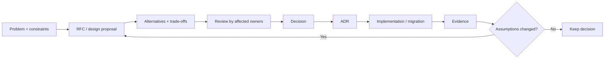

# RFCs, design proposals, ADRs and technical decision-making

## Wall Note / A4

- Use an RFC when a decision needs **collaborative exploration before commitment**.
- Use an ADR when a durable architectural/technical decision and its context must be remembered.
- Record constraints and rejected alternatives, not just the chosen solution.
- State the decision drivers explicitly: correctness, time, cost, operability, compatibility, scale, team ownership.
- Prefer reversible decisions with short feedback loops.
- Escalate process only with blast radius, irreversibility or cross-team impact.
- “Best practice” is not a decision argument without context.
- A decision is complete when implementation, migration and operational consequences are understood.
- Record what evidence would cause the decision to be revisited.
- Supersede old decisions; do not silently rewrite history.

## Detailed Notes

### RFC → decision → ADR

### When to write an RFC

Useful triggers:

- introduces a new shared platform or protocol;
- changes cross-team contracts;
- creates meaningful operational burden;
- affects security/privacy boundaries;
- creates long-lived data/storage commitments;
- migration is expensive or irreversible;
- multiple viable designs have material trade-offs.

Do not write an RFC for every local refactor.

### Decision frame

A mature design proposal includes:

- context and problem;
- goals/non-goals;
- constraints;
- current system;
- options;
- trade-off table;
- recommendation;
- migration/rollout;
- operability;
- risks;
- unresolved questions;
- decision deadline if timing matters.

### Trade-offs

Do not optimize every dimension simultaneously. Make costs explicit.

Example: synchronous validation may improve immediate consistency but add latency and availability coupling. Asynchronous validation may improve resilience but introduce eventual consistency and reconciliation complexity.

### Reversibility

Classify decisions:

- **easy to reverse**: local library choice with clean abstraction;
- **moderate**: API behavior used by a few controlled clients;
- **expensive**: public contract, data model at scale, cross-org platform;
- **effectively irreversible**: externally persisted semantics or commitments that cannot practically be migrated.

The more irreversible, the more evidence and review justified before commitment.

### Failure modes

- RFC as approval theater after coding is complete;
- architecture astronaut documents disconnected from delivery;
- choosing by authority rather than constraints;
- ADRs that contain only “we chose X”;
- documenting alternatives but not why they lost;
- no migration/operational implications;
- endless debate on reversible decisions.

## Practical Scenarios

### Scenario 1 — event bus introduction

Compare actual coupling, throughput, durability, debugging and ownership needs against simpler queues or direct calls. Record operational cost and migration plan, not only scalability benefits.

### Scenario 2 — API versioning

An ADR should capture consumer lifecycle, compatibility window, deprecation policy and operational support cost—not merely the URI version format.

## Senior Questions / Review Exercises

1. Is this decision expensive enough to deserve written design?
2. Which constraint actually separates the alternatives?
3. What cost are we accepting with the chosen option?
4. What is hardest to reverse?
5. Which affected owner has not reviewed this?
6. What future evidence would justify superseding the ADR?

## Related / Prerequisites

- [Requirements](01-sdlc-requirements.md)
- [Planning and risk](02-planning-estimation-risk.md)
- [Overengineering](17-overengineering-complexity.md)
- [software-architecture](https://github.com/YosrBennagra/software-architecture)
- [system-design](https://github.com/YosrBennagra/system-design)
- [design-patterns](https://github.com/YosrBennagra/design-patterns)