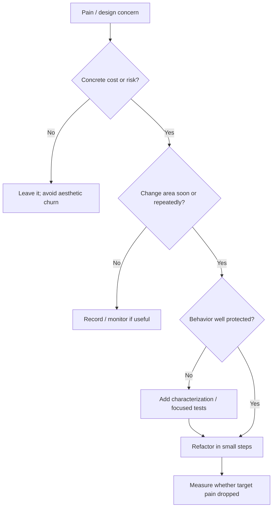

# Refactoring and technical-debt management

## Wall Note / A4

- Refactor to improve a named future change, reduce risk, remove duplication of knowledge, or restore a violated boundary—not to satisfy vague aesthetics.
- Protect behavior before changing structure.
- Prefer **small behavior-preserving steps** over rewrite-sized refactors.
- Keep feature work and broad refactoring separable when that improves review and rollback.
- Treat technical debt as an economic liability: interest, probability of payment, and cost to retire.
- Fix debt near high-change/high-risk paths first.
- Do not label every imperfect design “debt”; some is a conscious trade-off.
- Record intentional debt with impact, trigger and owner.
- Delete obsolete abstractions instead of endlessly generalizing them.
- Stop refactoring when the target risk/cost is reduced enough.

## Detailed Notes

### Decide whether to refactor

Useful debt dimensions:

- **interest**: how much extra cost does this create per change/incident?
- **principal**: cost to remove it;
- **exposure**: how often is the area touched?
- **risk**: can it cause correctness/security/operability failures?
- **option value**: would cleanup unlock important future work?

A messy file touched once every two years may be lower priority than a moderately awkward boundary that slows every sprint.

### Refactoring safety

Use characterization tests when behavior is unclear. Establish seams around external calls or unstable dependencies. Change one structural property at a time where possible. Keep the system runnable. For risky legacy changes, pair refactoring with migration techniques from the next topic rather than attempting a clean-room rewrite.

### Debt portfolio

Classify debt:

- deliberate/strategic: consciously accepted to meet a deadline;
- accidental: created through insufficient knowledge;
- environmental: dependencies/platform assumptions became obsolete;
- architectural: boundaries no longer match business/system reality;
- operational: missing diagnostics/runbooks make change expensive.

The response differs. Deliberate debt needs a trigger for repayment. Environmental debt may need upgrade cadence. Architectural debt may require staged migration rather than local cleanup.

### Failure modes

- “rewrite because old code is ugly”;
- refactoring without tests or production evidence;
- giant cleanup mixed into a feature PR;
- abstraction created before variation exists;
- debt backlog containing thousands of unactionable complaints;
- repeatedly postponing debt that causes incidents or blocks delivery;
- optimizing metrics such as file length while harming cohesion.

## Practical Scenarios

### Scenario 1 — duplicated pricing logic

Three services calculate the same rule differently and defects recur. First identify the authoritative business invariant, add tests around known cases, then consolidate through a stable domain boundary. Do not merely extract a shared helper if ownership remains ambiguous.

### Scenario 2 — oversized module

A 2,000-line module is not automatically bad. Map change reasons and dependencies. Split only where responsibilities and lifecycle differ; avoid turning one cohesive module into dozens of pass-through files.

## Senior Questions / Review Exercises

1. What measurable pain is this refactor meant to remove?
2. What behavior must remain unchanged?
3. Where is the cheapest seam for safe change?
4. Is this debt causing recurring “interest,” or is it aesthetic discomfort?
5. Can repayment be coupled to imminent feature work without exploding scope?
6. What stop condition prevents endless cleanup?

## Related / Prerequisites

- [Legacy migrations and compatibility](08-legacy-migrations-compatibility.md)
- [Overengineering](17-overengineering-complexity.md)
- [programming-principles](https://github.com/YosrBennagra/programming-principles)
- [testing-engineering](https://github.com/YosrBennagra/testing-engineering)
- [software-architecture](https://github.com/YosrBennagra/software-architecture)