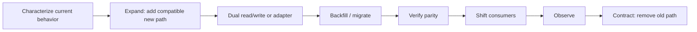

# Legacy-system changes, safe migrations, backward compatibility and deprecation

## Wall Note / A4

- Assume legacy behavior has unknown consumers until proven otherwise.
- Characterize before replacing.
- Prefer **expand → migrate → verify → contract** for schemas and contracts.
- Keep old and new representations compatible during the transition.
- Make migrations restartable, observable and idempotent where practical.
- Separate data migration from code cutover when that reduces risk.
- Design deprecation around consumer migration, not provider convenience.
- Define rollback limits before destructive steps.
- Remove compatibility code only after evidence says it is unused.
- A strangler migration is successful only when the old path is actually retired.

## Detailed Notes

### Migration strategy

### Legacy-change workflow

1. Identify business invariants and actual runtime usage.
2. Add characterization tests around critical behavior.
3. Create a seam: adapter, facade, endpoint version, new column/table, routing boundary.
4. Introduce the new path without breaking the old path.
5. Migrate data or consumers in bounded batches.
6. Verify correctness and operational behavior.
7. Shift authority to the new path.
8. Wait through an agreed observation window.
9. Remove old compatibility code and data.
10. Document what changed and close migration debt.

### Data migrations

For large data:

- estimate cardinality from production data;
- batch work to avoid lock/resource spikes;
- checkpoint progress;
- make retries safe;
- track failed records explicitly;
- verify counts and semantic invariants, not just “job succeeded”;
- define whether writes continue during backfill;
- avoid destructive cleanup until rollback window closes.

### Backward compatibility

Compatibility includes:

- API request/response shapes;
- database data read by older code;
- events/messages retained in queues/logs;
- stored configuration;
- client behavior and cached data;
- operational scripts and reports.

A server deployment that is compatible with itself can still break older mobile clients, delayed events or asynchronous workers.

### Deprecation

A useful deprecation policy states:

- what is deprecated;
- replacement;
- affected consumers;
- deadline/window;
- telemetry used to detect remaining usage;
- communication path;
- what happens after the deadline.

“Deprecated” without removal criteria becomes permanent complexity.

### Failure modes

- big-bang rewrite;
- destructive migration before all consumers move;
- assuming no consumers because source search found none;
- dual-write without reconciliation;
- rollback plan that cannot restore transformed data;
- permanent adapters/flags;
- silent behavior changes under an unchanged contract.

## Practical Scenarios

### Scenario 1 — rename a database field

Do not rename directly if multiple versions may run concurrently. Add the new field, write both, backfill, switch reads, verify, then remove the old field in a later release.

### Scenario 2 — replace a legacy service

Route one capability through an adapter to the new service, compare outcomes, migrate consumers gradually, and maintain fallback until confidence is sufficient. Avoid cloning every old behavior if some behavior is obsolete—explicitly decide what compatibility is required.

## Senior Questions / Review Exercises

1. Which consumer is hardest to discover?
2. What happens when old and new versions run simultaneously?
3. Can the migration be resumed safely after partial failure?
4. Which invariant proves data parity?
5. At what point does rollback stop being safe?
6. What evidence authorizes deleting the old path?

## Related / Prerequisites

- [Refactoring and debt](07-refactoring-technical-debt.md)
- [Rollout and rollback](09-rollout-rollback.md)
- [Production incidents](11-production-incidents-postmortems.md)
- [testing-engineering](https://github.com/YosrBennagra/testing-engineering)
- [devops-platform-engineering](https://github.com/YosrBennagra/devops-platform-engineering)
- [observability-reliability](https://github.com/YosrBennagra/observability-reliability)