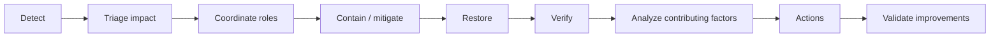

# Production ownership, incident collaboration and postmortem culture

## Wall Note / A4

- The team that changes a system shares responsibility for understanding how it behaves in production.
- During incidents: stabilize first, investigate second, improve third.
- Establish a clear incident lead for coordination; experts can investigate in parallel.
- Prefer reversible mitigation with bounded blast radius.
- Keep a timestamped decision/action log.
- Communicate known facts, impact and next update point; do not speculate as fact.
- Preserve evidence before destructive mitigation when feasible.
- Postmortems are for learning and system improvement, not blame assignment.
- Actions must change detection, prevention, containment or recovery—not merely say “be careful”.
- Close the loop: verify that follow-up actions were actually effective.

## Detailed Notes

### Incident lifecycle

### Production ownership before incidents

Ownership includes:

- understanding critical user flows and dependencies;
- knowing where operational signals live;
- knowing rollback/disable paths;
- keeping runbooks current for non-obvious operations;
- designing changes with operability in mind;
- learning from recurring support/incident patterns.

Deep telemetry/SLO design belongs in observability-reliability; this topic focuses on engineering behavior.

### Incident roles

Depending on scale:

- incident lead: coordinates priorities and decisions;
- technical responders: investigate/mitigate;
- communications owner: stakeholder/user updates;
- scribe: timeline, hypotheses, actions.

One person may hold multiple roles in a small team. The important point is avoiding ten engineers independently changing production with no shared model.

### Decision quality under pressure

Use short loops:

1. current impact;
2. best mitigation options;
3. blast radius and reversibility;
4. action owner;
5. verification;
6. next hypothesis if ineffective.

Pause speculative cleanup. Reduce variables.

### Postmortem analysis

Capture:

- impact and duration;
- detection;
- timeline;
- technical and organizational contributing factors;
- what worked;
- what delayed recovery;
- why defenses did not prevent/contain/detect;
- actions with owners and intended outcomes.

Blameless does not mean responsibility-free. It means analyze system conditions instead of stopping at “engineer made mistake.”

### Good actions

Weak: “Developers should test better.”

Better: “Add contract test for malformed partner payload and reject before persistence.”

Weak: “Be more careful during deploy.”

Better: “Require staged rollout for changes affecting payment routing and add automated rollback gate on error-rate threshold.”

### Failure modes

- incident channel with no lead;
- simultaneous uncontrolled mitigation attempts;
- hiding uncertainty in stakeholder updates;
- postmortem ending at human error;
- dozens of low-value action items;
- no owner/deadline/verification for actions;
- never retiring emergency flags or temporary bypasses.

## Practical Scenarios

### Scenario 1 — bad deployment plus data side effects

First disable the affected path to stop new corruption. Determine whether code rollback is data-compatible. If not, roll forward with a guarded fix while separately reconciling affected records.

### Scenario 2 — dependency outage

If a downstream system fails, investigate whether graceful degradation/circuit behavior works as designed. Recovery learning may concern your system’s dependency handling even though the initial failure was external.

## Senior Questions / Review Exercises

1. What is the fastest safe mitigation?
2. Which action could make recovery harder?
3. Who currently owns coordination?
4. What evidence must be preserved?
5. Which defense should have prevented, contained or detected this sooner?
6. How will we verify postmortem actions reduced future risk?

## Related / Prerequisites

- [Debugging](10-debugging-problem-solving.md)
- [Rollout and rollback](09-rollout-rollback.md)
- [Technical communication](13-technical-communication-feedback.md)
- [observability-reliability](https://github.com/YosrBennagra/observability-reliability)
- [devops-platform-engineering](https://github.com/YosrBennagra/devops-platform-engineering-)