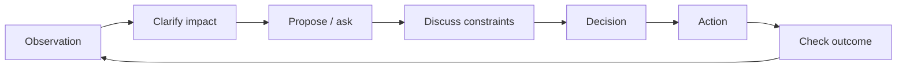

# Technical communication and engineering feedback

## Wall Note / A4

- Lead with context, decision needed and impact; add detail afterward.
- Separate facts, hypotheses, opinions and decisions.
- State uncertainty explicitly without becoming vague.
- Write for the audience’s decision, not to display everything you know.
- Use examples, diagrams and concrete failure cases when abstractions are ambiguous.
- Disagree with reasoning and constraints, not people.
- Give feedback that is specific, observable and actionable.
- Label blocking feedback versus preference.
- Confirm shared understanding on irreversible or cross-team decisions.
- Close communication loops: decision, owner, next step and unresolved questions.

## Detailed Notes

### Technical communication shape

A useful engineering update often fits:

1. **Context** — what changed or what problem exists.
2. **Impact** — users/systems/timeline affected.
3. **Evidence** — what is known.
4. **Uncertainty** — what is not yet known.
5. **Decision / ask** — what needs agreement or action.
6. **Recommendation with trade-offs** — when a choice is needed.
7. **Next step and owner**.

This is better than chronological narration of everything investigated.

### Choosing communication depth

Use chat for quick coordination, issues for tracked work, PRs for change-specific reasoning, RFCs for collaborative design, ADRs for durable decisions, runbooks for operational procedures, and incidents channels for time-sensitive coordination. Do not force one tool to hold every kind of information.

### Disagreement

Productive disagreement tests assumptions:

- “Which requirement makes option B unacceptable?”
- “If latency matters more than consistency here, option A becomes stronger.”
- “This adds an operational dependency; is that cost justified by current scale?”

Avoid “senior says so,” appeals to fashion, or turning design choices into identity.

### Feedback

A practical feedback model:

**Observation → engineering impact → requested change / question**

Example: “This method writes the payment before storing the idempotency key. A retry after the first write can duplicate the charge. Blocking: make the operation idempotent or persist the guard atomically.”

Feedback should be proportionate. Not every naming preference deserves a review thread.

### Receiving feedback

- identify the engineering concern underneath wording;
- ask for evidence/constraints when unclear;
- change your mind when the argument is stronger;
- explain why you disagree when trade-offs differ;
- do not equate defending a design with defending yourself.

### Feedback loop

### Failure modes

- long updates with no decision or ask;
- presenting guesses as facts;
- hiding bad news until certainty is perfect;
- public feedback focused on status/personality;
- vague comments such as “clean this up”;
- passive agreement followed by private disagreement;
- documenting decisions in ephemeral chat only.

## Practical Scenarios

### Scenario 1 — architecture disagreement

Two engineers prefer different persistence strategies. Reframe around throughput, consistency, recovery, team expertise and migration cost. If trade-offs remain material and durable, capture the decision in an ADR.

### Scenario 2 — missed estimate

Communicate early: original assumption, new evidence, impact on range, options to reduce scope, and recommended next move. Do not merely report “we need more time.”

## Senior Questions / Review Exercises

1. What decision should the reader be able to make after reading this?
2. Which sentence is fact and which is hypothesis?
3. Is feedback tied to a real engineering impact?
4. Which detail can be removed without reducing understanding?
5. Has the decision been captured somewhere durable?
6. What would make you change your recommendation?

## Related / Prerequisites

- [Code review](04-code-review-prs-integration.md)
- [RFC/ADR decisions](06-rfc-adr-decision-making.md)
- [Mentoring](14-mentoring-knowledge-sharing.md)
- [Production incidents](11-production-incidents-postmortems.md)