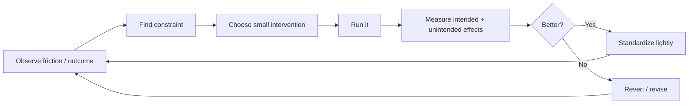

# Engineering effectiveness and continuous improvement

## Wall Note / A4

- Improve the system of work, not individual busyness.
- Measure only to support a decision or detect a problem.
- Prefer flow, quality, reliability and developer friction signals over raw activity counts.
- Never use lines of code, commits, PR count or story points as productivity targets.
- Find queues and repeated friction before buying tools.
- Automate repeated objective work; do not automate unclear process.
- Improve one constraint, observe, then iterate.
- Treat recurring incidents/review comments/manual steps as signals for systemic improvement.
- Protect focus time and reduce avoidable work in progress.
- Verify that process changes produced the intended effect.

## Detailed Notes

### Effectiveness model

### Useful signals

Depending on context:

- lead/cycle time;
- review wait time;
- deployment frequency;
- change failure/recovery behavior;
- flaky-test rate;
- build duration;
- onboarding/setup success;
- recurring defect classes;
- incident toil;
- WIP/aging;
- time blocked on external dependencies.

Do not turn metrics into individual scorecards; Goodhart’s law will convert them into gameable output.

### Friction inventory

Ask engineers periodically:

- what repeated manual step wastes time?
- what test/build step is slow or unreliable?
- where do reviews wait?
- which ownership boundary is unclear?
- which recurring incident/support task should be designed out?
- which local environment/documentation step fails often?

Then rank by frequency × time × risk × number of people affected.

### Continuous improvement

Good improvements are often boring:

- remove obsolete approval;
- reduce PR batch size;
- fix flaky tests;
- standardize local setup;
- add a migration template;
- automate dependency checks;
- clarify code ownership;
- shorten feedback from CI;
- remove unused service/flag.

### Failure modes

- productivity dashboards based on activity;
- process changes with no hypothesis;
- tooling introduced before understanding the bottleneck;
- optimizing coding speed while review/deploy queues dominate;
- retro action items never checked;
- organization-wide standard for a local problem;
- “continuous improvement” creating continuous process churn.

## Practical Scenarios

### Scenario 1 — slow delivery

Coding takes one day but PRs wait three days for review. Adding AI coding tools does not address the constraint. Fix reviewer ownership, WIP, PR size or queue visibility first.

### Scenario 2 — frequent release fear

If deployments are rare because rollback is unclear and tests are flaky, focus on those safety mechanisms rather than simply mandating more deployments.

## Senior Questions / Review Exercises

1. Where does work spend most time waiting?
2. Which metric could be gamed if turned into a target?
3. What small intervention tests the improvement hypothesis?
4. What unintended effect should we watch?
5. Which recurring manual action is suitable for automation?
6. Did the last process change measurably improve the intended outcome?

## Related / Prerequisites

- [Agile and cross-functional flow](12-agile-cross-functional.md)
- [Ownership](15-ownership-maintainability.md)
- [Senior/staff judgment](16-senior-staff-judgment.md)
- [devops-platform-engineering](https://github.com/YosrBennagra/devops-platform-engineering)
- [observability-reliability](https://github.com/YosrBennagra/observability-reliability)